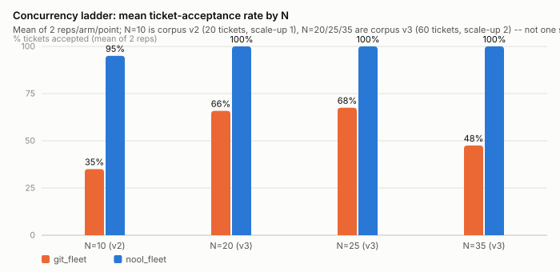

# Nool Benchmark Suite

Reproducible benchmarks measuring whether [Nool](https://nool.dev) — a
semantic-agentic VCS and coordination layer for coding agents — materially
improves coding-agent outcomes versus plain git, across agent harnesses
(Claude Code first; Gemini CLI, Codex CLI, Pi via the same adapter contract).

**Design spec / pre-registration:**
`docs/superpowers/specs/2026-08-20-nool-benchmark-suite-design.md` —
hypotheses H1–H7 and the analysis plan were committed before any Tier 1 data
was collected. Read it before the numbers.

## Why this suite, not an existing benchmark

Several published benchmarks already grade coding-agent output — the
obvious question is why not just run one of those. None of them put the
**VCS/coordination layer itself** on trial: they vary the model or the
task while the repo is written to by one agent at a time (or, in
CooperBench's case, a fixed N=2 with the coordination mechanism held
constant). This suite fixes the tasks and the agent count and varies
**git vs nool** as the treatment, scaled up across a concurrency ladder —
the one axis none of the below can speak to.

| Benchmark | Agents | Unit under test | Concurrent writers to one repo | Independent variable | Scale |
|---|---|---|---|---|---|
| SWE-bench (+ Verified / Lite) | 1 | GitHub issue → patch | No | model/agent | 2,294 tasks, 12 Python repos |
| SlopCodeBench | 1 | agent re-extends its own prior solution across checkpoints | No | model/agent, long-horizon only | 20 problems × 93 checkpoints |
| SWE-EVO | 1 | multi-file feature evolution from real release notes | No | model/agent | 48 tasks, 7 repos, avg 21 files/task |
| CooperBench | 2 (fixed) | two features landed on one shared repo concurrently | Yes — real merge-conflict risk | task difficulty / model; coordination mechanism (git + Redis messaging) held fixed | ~600 tasks, 12 repos, 4 languages (arXiv:2601.13295) |
| **nool_benchmarks (this suite)** | N=10–50 (concurrency ladder) | ticket-level changes dispatched across a shared corpus | Yes — merge conflicts / build-poisoning / attribution ARE the metrics | **VCS/coordination substrate: git vs nool**; tasks and agent count held fixed | 60-ticket corpus v3; N=25 and N=35 measured to date, N=50 pre-registered |

CooperBench is the closest existing analog — the only one of the four with
real concurrent-writer risk — which is why it's already planned as a Tier 2
adaptation (Track A1, spec §5) rather than something this suite ignores.
The relationship is an inversion, not a duplication: CooperBench fixes the
coordination mechanism and varies task difficulty at N=2; this suite fixes
the tasks and varies the coordination mechanism at fleet scale. SlopCodeBench
(Track A2) and SWE-EVO (Track A3) are single-agent and contribute nothing on
the concurrency axis, but are still adapted for their own axes (long-horizon
degradation, multi-file evolution) rather than duplicated by Track D.

*Note on the CooperBench figure above:* the paper (arXiv:2601.13295) reports
~600 tasks across 12 repos / 4 languages; a public adapter repository for the
same benchmark lists smaller subset counts (199 features / 30 tasks / 652
feature pairs). The paper figure is cited as canonical here — confirm
directly against the benchmark's own source before the Track A1 integration
relies on either number.

## Findings at a glance (runs 1–3, fleet scale-up 1 and 2, nool 7.0.0/7.0.1, footprint-source robustness §8d; 2026-08-20/27)

Full report with figures and provenance:
[`docs/findings/2026-08-21-findings.md`](docs/findings/2026-08-21-findings.md) ·
academic write-up: `docs/paper/2026-08-nool-fleet-study.md`. One pinned
model (claude-sonnet-5) throughout; product versions 6.13.0 → 6.14.1 →
7.0.0 → 7.0.1 recorded per run.



1. **Admission-time coordination prevents fleet contention.**
   Pre-registered concurrency ladder, function-level contention, corpus
   v3 (60 tickets) at N=25 and N=35: footprint-gated dispatch held 60/60
   accepted with zero merge conflicts across all four reps, while
   ungated git lost roughly a third of tickets to conflicts at every N
   (flat 20–22 at N=20/25/35) and, at N=35, additionally hit
   build-poisoning (37/60 and **20/60**, the latter a textually-clean
   merge voiding 18 further tickets). Spend per accepted ticket stayed
   lower for the gated arm at every point measured ($0.11–0.21 vs
   $0.18–3.80 for git).
2. **An ideal git scheduler matches nool under perfect footprints.** The
   2026-08-22 attribution audit (paper §5.6) found the original gating
   was computed by the harness from corpus-declared footprints — nool's
   own conflict verdicts were advisory and never consulted — so the
   separation in (1) was established for the dispatch *policy*, not the
   product. Three ablation arms test this directly (spec §8c):
   `git_scheduled` (git under the identical scheduler), `git_gated_queue`
   (a CI-gated merge queue), `nool_gated` (dispatch gated by nool's real
   `announce intent` refusals). At N=10 and again at N=35/v3.1
   (2026-08-27, findings §6c), `git_scheduled` matches `nool_gated` and
   `nool_fleet` — zero conflicts, effectively identical accept rates —
   confirming the separation tracks coordination *policy*, not the tool,
   whenever footprint information is accurate.
3. **Integration-time gating is too late and wastes agent work.**
   `git_fleet`'s ungated parallel dispatch lets every agent start
   regardless of overlap, so conflicts are discovered only at merge —
   $1.40–1.57 of each scale-up-1 run's spend (§2.3) produced work that
   never integrated; `git_gated_queue`'s CI gate catches build-poisoning
   but is checked after the same ungated dispatch, so it inherited the
   same ~20/60 conflict rate and ~$3.3–3.4 of wasted spend per rep at
   N=35 (2026-08-27 data). Admission-time gating (`nool_gated`,
   `git_scheduled`, `nool_fleet`) keeps wasted spend near $0 by refusing
   the conflicting ticket before an agent ever starts on it.
4. **Under footprint noise, nool currently degrades more slowly than an
   oracle-scheduled git baseline, and the gap widens monotonically at
   every noise level tested (2 reps/cell; suggestive, not conclusive).**
   2026-08-27 sub-study (§8d, findings §6d–§6g): `nool_gated` vs
   `git_scheduled` at N=20 across four noise levels. Both hit 60/60 under
   perfect information; the accept-rate gap between them then opens at
   every step — 0 (zero-noise) → 2 (light: 58 vs 56) → 3 (heavy: 58 vs
   55) → **4** (very-heavy, 0.5/0.5: 53 vs 49) — with `git_scheduled`'s
   conflict count also rising faster throughout (roughly doubling from
   heavy to very-heavy, 5.5 vs `nool_gated`'s 4.5). The pre-registered
   prediction (gap widens, not narrows or reverses) held at every
   measured point. Still n=2/cell and correlational — the mechanism
   (`nool merge`'s extra check vs. blind `git merge`) is the leading
   hypothesis, not a directly observed cause.
5. **Accepted-ticket counts can hide broken final-system states.** The
   same corpus cluster (`t2`/`t9`/`t10`/`t11`/`t21`/`t22`, all declaring
   `service/billing.go`) that caused scale-up 1's 1/20 git-arm collapse
   (§2.4) recurred in §8d's zero-noise `git_scheduled` anchor: 60/60
   accepted, yet 16 broken-main events and a failed final smoke test
   (§6f) — a corpus artifact, not a noise effect, but a standing
   reminder that "accepted" and "final main is healthy" are different
   measurements this suite tracks separately for exactly this reason.
6. **Mechanism benchmarks (Track B) show attribution, recovery, and
   governance advantages, alongside known latency and product defects.**
   Perfect write attribution under shared-workspace concurrency (git
   sweeps up to 56% of ops at N=15); context retrieval in 163–408 bytes
   vs 660 for grep+read. On 6.14.1: contended merges converge 15/15 (were
   1/15 on ≤6.14.0), selective undo preserves later unrelated work 5/5
   (was 0/5), bisect names the true culprit. On 7.0.0, bisect regressed
   (can name an untraceable synthetic knot, §6a) — 3 of 4 7.0.0 bugs
   found this study were fixed in 7.0.1, one remains (`nool.toml`
   `[bridge]`/`[try]` misconfiguration breaks `try new --worktree` with a
   misleading error). B4: the default governed path rejects test-breaking
   changes; the `--fast` relaxed path accepts them as an explicit,
   attributable risk-control knob. Landing latency stays roughly 7–10×
   git throughout.
7. **No-contention workloads remain null.** Without designed contention
   (2×2 grid, 5-worker pilot, v1 corpus) the arms do not separate on any
   metric, in any run.

## Layout

| Path | What |
|---|---|
| `micro/` | Track B — deterministic mechanism micro-benchmarks (no LLM, no API keys, free to run) |
| `results/micro/` | Raw JSON output of Track B, committed with full provenance |
| `harness/` | Track C — LLM-in-the-loop 2×2 experiment harness; Track D fleet runner (`fleet_run.py`) |
| `tasks/` | Track C/D task catalogs (spec + starter + hidden held-out tests; fleet ticket corpora) |
| `results/trackc/` | Raw LLM-run records: 2×2 grid (`runs.jsonl`) and fleet runs (`fleet_runs.jsonl`) |
| `results/trackc/transcripts_manifest.jsonl` | SHA-256 manifest of every raw transcript (transcripts themselves are gitignored; verify with `make check-transcripts`) |
| `results/replications/` | Per-version Track B snapshots + `MANIFEST.md` indexing every run's conditions |
| `analysis/summarize.py` | Renders all committed results as tables, incl. run-level cross-rep inference (exact permutation Mann-Whitney per corpus/N/model cell, underpowered cells labeled). Numbers only — no conclusions in code |
| `analysis/make_figures.py` | Regenerates every figure in `docs/findings/` from the raw JSON |
| `Makefile` / `Dockerfile` | One-command replication (`make trackB`, `tier1`, `trackC`) and containerized execution (spec §8) |
| `docs/findings/` | Findings report with figures; `docs/paper/` holds the academic write-up |

Pre-suite pilot material (manual runs, no provenance — **not evidence**) was
archived and then removed from the working tree; it remains recoverable from
Knot DAG history (the `archive/` knots of 2026-08-20, including
`ARCHIVE.md`, which inventories it and explains why each item is excluded).

## Running Track B (anyone can, free)

Requirements: macOS/Linux, Python 3.11+, git, and the `nool` CLI on PATH
(version is recorded in each result's provenance block).

```bash
cd micro
python3 b1_overhead.py      # hook latency; propose/solidify vs add/commit
python3 b2_concurrency.py   # N concurrent writers, one shared workspace
python3 b3_recovery.py      # remove a bad landing, keep later unrelated work
python3 b4_guardrails.py    # broken/test-breaking commits vs a git control arm
python3 b5_swarm_merge.py   # N-branch merge: disjoint / same-anchor / diff-functions
python3 b6_context_retrieval.py       # semantic query vs grep+read baseline
python3 b7_regression_localization.py # nool debug bisect vs git bisect
python3 ../analysis/summarize.py
```

Each script builds isolated throwaway workspaces under the system temp dir,
times with monotonic clocks (ms), and writes one JSON file to
`results/micro/` including provenance (nool/git/python versions, platform,
timestamp). Re-running overwrites with your own provenance — replication
means comparing effect directions, not reproducing exact milliseconds.

Methodology notes that matter when reading results:

- Merge outcomes (B5) are detected from working-tree state (unmerged paths,
  conflict markers), never from exit codes; exit-code reliability is itself
  a recorded metric.
- B2's git arm counts a change as landed even when another writer's commit
  swept it in (`ops_swept_into_other_commit`) — attribution loss and landing
  are reported separately.
- B1's 100-file cell uses `--auto-justify` because nool's blast-radius gate
  blocks wide non-interactive proposes; the gate's existence is part of the
  result.
- B3 reports both a linear timeline and a thread-separated timeline for
  nool's `pluck` recovery path.

## Running Track C (LLM-in-the-loop; costs money)

Track C drives real agent CLIs headlessly over tasks in `tasks/`, in a 2×2
design (VCS: git|nool × mode: single|multi), N repetitions per cell, with the
**same pinned model in every cell** of an experiment. Hidden acceptance tests
are copied into the workspace only at scoring time.

```bash
cd harness
python3 run_experiment.py --harness claude --model <pinned-model-id> \
    --tasks redux_go --cells all --reps 5
```

The adapter records exact token counts, turns, and tool calls from the
harness's own accounting — estimated metrics are banned; anything a harness
does not expose is reported as null. See `harness/README.md` for the adapter
contract if you are adding gemini/codex/pi.

## Frozen cross-repository protocol (v4)

Future comparative fleet evidence is governed by
`protocols/fleet_v4.json`, pinned by `protocols/fleet_v4.sha256`. Its primary
unit is the run, its minimum target is 10 repetitions per arm/cell, and its
primary comparisons put native nool coordination against `git_competitive`:
declared-footprint scheduling under recorded noise, a build/test/secret-gated merge queue, and
one rebase-or-agent-rerun conflict recovery pass.

The fleet runner is now language-neutral. A task root supplies a pinned
starter, ticket/footprint metadata, held-out acceptance assets, and argument-
array build/test/accept commands; see `tasks/CORPUS_CONTRACT.md`. Every new
record carries repository, language, source kind, command contract, and the
frozen protocol hash. Analysis strata include repository, language, model,
harness, worker count, tier, and footprint noise, and never use tickets as
independent replicates.

```bash
make validate-study     # protocol pin, corpus contracts, unit tests
make validate-harness   # every arm once, deterministic scripted adapter, $0
python3 harness/fleet_run.py --harness claude --model <pinned-model-id> \
    --task-root tasks/fleet_service --tickets tickets_v3.json \
    --arms git_competitive,nool_gated --workers 10 --reps 10
```

This implements the comparative framework; it does not manufacture external
validity. The repository currently contains only the synthetic Go corpus.
Imported CooperBench-style tasks and additional real TypeScript, Python, and
Java/Rust repositories must retain their upstream prompts and acceptance
criteria and must be committed before multilingual or independent-replication
claims are made.

Current status: Track B complete on four product versions (6.13.0,
6.14.0, 6.14.1, 7.0.0) with per-version snapshots under
`results/replications/`. Track C grid run three times (19/20, 20/20,
18/20; no arm separation). Track D fleet: pilot plus pre-registered
scale-up 1 complete (first arm separation — see the findings report);
scale-up 2's pre-registered concurrency ladder (N ∈ {10, 25, 35, 50}) has
N=10 (v3 anchor, nool 7.0.0), N=25, and N=35 complete on the hardened
corpus v3 for git_fleet/nool_fleet, plus an off-ladder N=20 point —
separation holds at every measured N (see the attribution audit above for
what "with N" can and cannot mean under this design). The §8c
arm-decomposition study (git_gated_queue / git_scheduled / nool_gated) is
implemented and run: smoke-tested clean on the 8-ticket v1 corpus and at
N=10/v3, with `git_scheduled` matching the nool arms and confirming the
policy-not-tool reading (§6a of the findings report). A sixth arm,
`nool_try` (nool 7.0.x's native per-agent try-lifecycle, added
2026-08-26), is measured at N=10, N=25, and N=35 on v3 (59–60/60 every
rep, 2 reps per point). The nool-side §8c targets at N=35 are complete —
`nool_gated` and `nool_fleet` both at 5/5 reps (59–60/60, zero conflicts;
nool 7.0.1 tranche, findings §6b, including two single-ticket
`SQLite error 517` merge losses attributed to nool-internal store
contention). Remaining: the git-side §8c reps at N=35 on the original v3
corpus (`git_gated_queue` 3/5, `git_scheduled` 2/5 — still deferred), and
N=50 for any arm — deferred, flagged as a real memory-exhaustion risk on
the 16GB development machine used for this study. **2026-08-27**: a
same-day harness-hardening commit (`163a896d`) was found to have edited
`tickets_v3.json` in place (strengthened t4/t36/t54 tests, corpus label
bumped to `v3.1`); two attempts to fill the v3 git-side gap landed as
`v3.1` records instead, so that gap remains open (findings §6c). The
mismatch was extended into its own scope-reduced N=35/v3.1 point —
`git_gated_queue` (2 reps, 40/60 both, 20 conflicts each) and
`git_scheduled` (3 reps, 60/59/59 of 60, zero conflicts) matched against
fresh `nool_gated`/`nool_fleet` v3.1 reps (2 each, 59–60/60, zero
conflicts) — directionally consistent with every other N=35 result.
**2026-08-27, §8d footprint-source robustness** (`nool_gated` vs
`git_scheduled` under injected footprint noise, N=20, corpus v3.1, 2
reps/cell across 4 noise levels — still below this suite's "3+" bar but
no longer a single draw). Re-ranked and root-caused in findings §6f
after initial framing in §6d/§6e buried the strongest result under one
needing heavy qualification. Strongest: the accept/conflict degradation
curve, now replicated at every level with a monotonically widening gap
(§6g) — zero-noise 60/60 both arms (0 conflicts each, gap 0); light
noise `nool_gated` 58/60 (1 conflict) vs `git_scheduled` 56/60
(4 conflicts, gap 2); heavy noise `nool_gated` 58/60 (2 conflicts) vs
`git_scheduled` 55/60 (5 conflicts, gap 3), the heavy cell landing an
*identical* 58-vs-55 split in both independent reps; very-heavy
(0.5/0.5) `nool_gated` 53/60 (6 conflicts) vs `git_scheduled` 49/60
(10.5 conflicts, gap 4) — the pre-registered prediction that the gap
would widen, not narrow or reverse, held at every step. `nool_gated`
degrades more slowly than an oracle-scheduled git baseline as footprint
quality drops — suggestive, not conclusive, at n=2, and still
correlational (the leading mechanism, `nool merge`'s extra check vs.
blind `git merge`, is not directly observed). Also important, but traced
away from §8d itself:
rep 1's zero-noise `git_scheduled` run hit 16 broken-main events and a
failed final smoke test despite 60/60 accepted; root cause is ticket
**t10** ("Processing fee"), part of a known "cluster-A" contention
family (t2/t9/t10/t11/t21/t22, all declaring `service/billing.go`)
documented since §2.4 — a corpus artifact designed to compose
incorrectly across sequential billing-logic changes, occurring here with
**zero injected noise**, so it is not §8d evidence about noise
robustness. It remains a real demonstration that accepted-ticket counts
and final-main health are not the same measurement. One pre-registered
prediction (refusal-log correlation with injected noise) was measured
via a per-ticket cut and came back null/inconsistent. A wall-time
pattern — `nool_gated` stable at 316-372s across all six runs,
`git_scheduled` ranging 271-589s and *faster* under heavier noise — is
reported as a secondary, heavily-qualified observation: `git_scheduled`
finishing sooner under noise reflects doing less successful work (a
conflicting `git merge` aborts before the expensive build+smoke
pipeline), not higher efficiency, and the same caveat applies to raw
throughput. Full detail, root-cause tracing, and the corrected ranking
in findings §6d-§6g; a third rep per cell remains the natural next step
if quota allows. External benchmark adaptations (CooperBench,
SlopCodeBench) are Tier 2 — see the spec.

## Threats to validity

Disclosed in the spec (§7) and repeated here: this is a vendor-run
evaluation, pre-registered to mitigate that (spec hash pinned and
tamper-evident: `docs/superpowers/specs/PRE_REGISTRATION.sha256.md`;
external timestamping still recommended before paper-grade claims); LLM
cells at small N are labeled underpowered — `analysis/summarize.py` now
prints the run-level inference table with per-cell power labels rather
than leaving power implicit; execution for all collected results was
local rather than containerized (recorded in every provenance block) —
the §8 container path now exists (`make docker-build`, `make
docker-trackB`) and future runs should use it so image IDs enter
provenance; the fleet arms' gating attribution
and baseline-policy limits are documented in the paper (§5.6) with
pre-registered ablation arms (spec §8c). Running nool arms: the free tier
(2,000 knots per project, 30 days) covers a full replication — a 60-ticket
fleet run consumes 62 knots, the whole suite ~1,200–1,500 — so the only
replication cost is LLM spend (~$7–10 per fleet run, disclosed per run).

**Governance visibility audit (2026-08-27).** The harness formerly copied
the nominally shared CI/CODEOWNERS/POLICY files after the base commit but
committed them only during nool setup. Git-agent worktrees therefore did not
receive those documents. Protocol-v4 setup now commits the shared governance
contract before either arm diverges and generates command-derived policy for
non-Go corpora. Historical records are preserved with their original harness
provenance; they must not be described as having identical visible policy
documents across arms.

## License

Apache-2.0 — see `LICENSE` and `NOTICE`. You may use, modify, and
redistribute freely; redistributions must retain the attribution notices
(Nool, Inc.) per the license terms.
