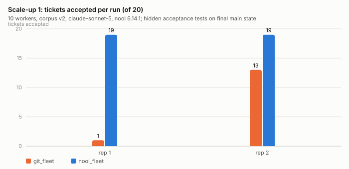
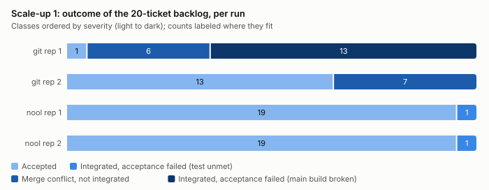
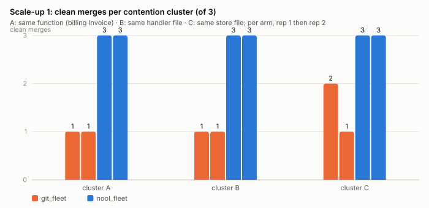
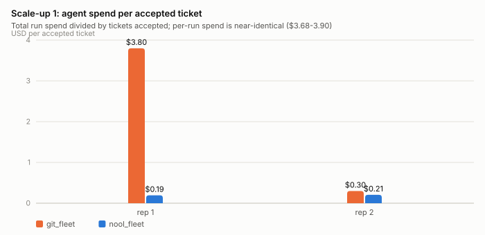
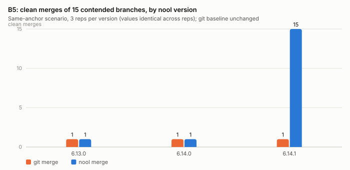
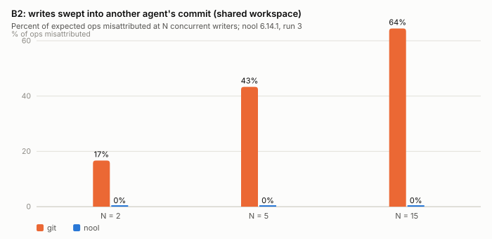
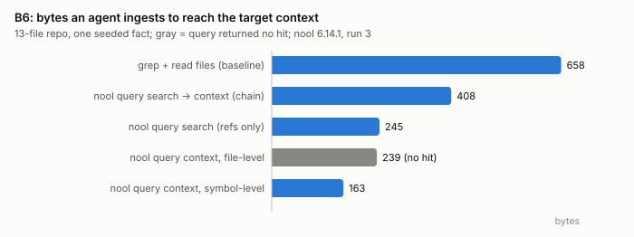

# Findings report: nool versus git for coding-agent fleets

**Status:** working report over runs 1–3, fleet scale-up 1 and 2 (N=20/25/35), the nool 7.0.0 rerun + nool_try arm, and the nool 7.0.1 ladder-completion tranche (§6b) · updated 2026-08-27
**Companion paper:** `docs/paper/2026-08-nool-fleet-study.md` (framework, methods, threats to validity)
**Pre-registration:** `docs/superpowers/specs/2026-08-20-nool-benchmark-suite-design.md`, committed before data collection; the scale-up 1 addendum was committed after the pilot and before any scale data.

All figures in this report are generated by `analysis/make_figures.py` from
committed raw result files only (`results/micro/*.json`,
`results/replications/*/`, `results/trackc/*.jsonl`); no plotted value is
estimated or aggregated beyond the arithmetic stated in each caption. Tables
restate the same values, so no finding depends on reading a chart.
Regenerate with `python3 analysis/make_figures.py`; recompute the tables
with `python3 analysis/summarize.py`.

**Conditions.** One pinned model (`claude-sonnet-5`) driven headlessly by
Claude Code CLI with user-level configuration excluded
(`--setting-sources project,local`); Go 1.26.2; git 2.50.1. The product
under test moved during the study — run 1: nool 6.13.0, run 2: 6.14.0,
run 3, scale-up 1, and scale-up 2 (N=20/25/35): 6.14.1; the 2026-08-26
rerun and nool_try arm: **7.0.0**; the 2026-08-26/27 ladder-completion
tranche (§6b): **7.0.1** — and version is recorded per run, so
cross-version deltas are attributable.

---

## 1. Summary of findings

**F1 — Under function-level contention, an uncoordinated 10-agent fleet
lost 35% to 95% of its backlog; the coordinated fleet lost 5% in both
replicates.** git arm: 1/20 and 13/20 tickets accepted; nool arm: 19/20
and 19/20, with 20/20 clean merges and a green main branch throughout both
runs (§2, Figs. 1–3).

**F2 — The git arm's two failure modes are integration conflicts and
silent semantic breakage; the second is the more damaging.** All git-arm
conflicts fell on the second or third member of a contention cluster. In
git rep 1, one further merge (t17) was textually clean yet broke the
build; because acceptance is scored on final main state, 13
previously-integrated tickets failed with it (§2.2).

**F3 — Coordination cost appears as wall time, not tokens.** Per-run agent
spend is near-identical across arms ($3.68–3.90); the nool arm's gated
dispatch adds 40–70% wall time (143 s and 179 s vs 100 s and 106 s).
Spend per accepted ticket: $0.19–0.21 (nool) vs $0.30 and $3.80 (git)
(§2.3, Fig. 4).

**F4 — Three of four adverse mechanism bounds moved with the 6.14.1
release; the fourth was clarified by testing both governance paths.**
Contended merge convergence went from 1/15 to 15/15 (git baseline: 1/15
throughout); selective undo went from destroying all later unrelated work
(0/5 preserved) to preserving it (5/5); bisect now names the true culprit.
B4 tested two governance paths: the **default governed path** (`nool propose
--solidify`) **rejects** test-breaking changes via full semantic validation;
the **explicit relaxed path** (`--fast`) **accepts** them as designed — this
is not a validation failure but a governance-mode semantics test. The
benchmark now separates: (1) default governed path catches semantic
violations; (2) `--fast` is an intentional risk-control knob; (3) authority
controls over the relaxed path (Track F) (§3.3).

**F5 — Attribution integrity under shared-workspace concurrency remains a
clean nool win, with a latency price.** At 15 concurrent writers, git
swept 56% of ops into other agents' commits; nool misattributed none
(90/90) in every run. nool's per-operation landing latency is roughly
7–10× git in every run (§3.2, Fig. 6).

**F6 — Token-economical context retrieval replicates.** Reaching a seeded
fact costs 163 bytes (symbol-level query) to 408 bytes (search-then-context
chain) versus 660 bytes for grep-plus-read, at the tested 13-file scale;
the file-level query returned no hit (§4, Fig. 7).

**F7 — Where contention is absent, arms do not separate.** The Track C
2×2 grid (N=5 per cell) and the 5-worker/8-ticket fleet pilot show no arm
difference in any run; scale-up 1's fillers and the v1 corpus behave the
same way. Separation appears exactly where designed contention converts
into baseline failures (§5).

**F8 — The git/nool separation strengthens, not just holds, as
concurrency grows; git's failure mode escalates from merge conflicts to
full build-poisoning.** On the 60-ticket corpus v3, nool held 60/60 with
zero merge conflicts across three concurrency points and six replicates
(N=20, 25, 35). git's mean acceptance rate moved 66% (N=20) → 68% (N=25)
→ 48% (N=35), and its worst single replicate got worse with N: a
clean-merge-but-failing-tests event at N=35 rep 1 (37/60), then a full
build-poisoning event at N=35 rep 2 that voided 18 tickets beyond its 22
merge conflicts (20/60) — the same bimodal failure distribution scale-up
1 first showed at N=10, now recurring at higher severity (§6, Fig. 8).

---

## 2. Fleet operations under contention (Track D, scale-up 1)

Pre-registered design: 20 tickets over a shared Go service, of which nine
form three contention clusters — A: three tickets editing the same function
body (`service/billing.go` Invoice); B: three tickets editing functions in
one handler file; C: three tickets extending one store file — at N=10
workers, two replicates per arm. `git_fleet` dispatches every ticket in
parallel and integrates through a sequential merge queue; `nool_fleet`
gates dispatch on declared footprints (announce/discover; a ticket waits
while a footprint-overlapping ticket is in flight) and integrates on
completion. Identical prompts, model, worker count, and worktree isolation.
Prediction, recorded before data: the git arm conflicts on each cluster's
2nd/3rd merges; the nool arm serializes clusters so later members branch
from integrated state and compose.

### 2.1 Primary result



| Run (nool 6.14.1) | Accepted | Clean merges | Final main health | Wall | Spend | Spend on failed integrations |
|---|---|---|---|---|---|---|
| git rep 1 (`fleet_git_fleet_9a6eb70f`) | 1/20 | 14/20 | build broken | 100 s | $3.80 | $1.40 |
| git rep 2 (`fleet_git_fleet_803f2288`) | 13/20 | 13/20 | green | 106 s | $3.87 | $1.57 |
| nool rep 1 (`fleet_nool_fleet_cb7ccf72`) | 19/20 | 20/20 | green | 143 s | $3.68 | $0 |
| nool rep 2 (`fleet_nool_fleet_2a51582f`) | 19/20 | 20/20 | green | 179 s | $3.90 | $0 |

### 2.2 Failure modes



Every git-arm conflict was the second or third member of a contention
cluster (rep 1: t10, t11, t12, t13, t16, t20; rep 2: t10, t11, t12, t13,
t16, t17, t20) — the predicted mode. The unpredicted mode dominated rep 1:
t17's merge exited clean, but the merged tree no longer compiled.
Main-branch health, recorded after every merge, is green through t16 and
broken from t17 onward. Since acceptance is evaluated against final main
state, 13 tickets that had integrated cleanly failed their acceptance
tests; only t19, whose test does not import the poisoned package, passed.
A single absorbed merge converted a 70%-style outcome into 1/20. The
git-arm outcome distribution at this contention level is therefore
bimodal: contention losses only, or near-total loss.



The nool arm integrated all nine cluster tickets in both replicates
(20/20 clean merges overall); its gated dispatch held same-footprint
tickets back until the prior member had merged, so each branched from
integrated state.

### 2.3 Cost



Per-run agent spend is near-identical across arms; the difference is
composition. In the git arm, $1.40–1.57 of each run's spend produced work
that never integrated; the nool arm wasted $0 on failed integration in
both replicates and paid instead in wall time (+40–70%).

### 2.4 Deviations and labeled variants

Recorded in `results/replications/MANIFEST.md` and the run ledger; all
affected runs remain in the raw data.

- **Worktree-creation race (harness, both arms).** Concurrent
  `git worktree add` corrupted `.git/worktrees` metadata under 10 workers
  and aborted one git rep after its agents had run (spend lost, no outcome
  data recorded). Creation is now serialized; agent execution is unchanged.
- **Dispatch-gate hole (harness, nool arm).** The first nool rep
  (`fleet_nool_fleet_16e2e1b0`, 18/20) ran with a scheduler bug: tickets
  admitted in the same batch did not see each other's footprints, so t9∥t10
  and t12∥t13 raced from a shared base and both pairs conflicted. The rep
  understates the nool arm and is excluded from the primary comparison.
- **Prior-version git rep.** A 10-worker git rep collected on nool 6.14.0
  before the version bump (`fleet_git_fleet_70dff997`, 15/20; same
  cluster-conflict pattern) is reported as a prior-version observation.
- **Host memory exhaustion.** One git rep was lost when the operator
  machine (16 GB) exhausted memory mid-run; no record was written. All
  subsequent runs executed sequentially under a free-memory watchdog, which
  did not trigger again.
- **t2 acceptance-test artifact.** Both nool replicates failed only t2.
  t2's pilot-era acceptance test hard-codes an invoice total that assumes
  the base tax path, while cluster-A ticket t10 adds a processing fee
  inside Invoice; the corpus-v2 tolerance hardening covered cluster A's own
  tests but not this pilot ticket. Observationally, t2 passed in exactly
  the runs where t10 failed to integrate (git rep 2; the gate-hole variant)
  and failed in exactly the runs where t10 landed (both primary nool reps).
  The artifact thus penalizes only the arm that integrates contended work
  successfully. Scores are reported as measured, per protocol; the corpus
  fix is scheduled for the next scale-up. Zero of the nool arm's
  non-acceptances are integration failures.

## 3. Mechanism benchmarks across product versions (Track B)

The deterministic benchmarks were run in full on each product version.
Four adverse bounds were identified on 6.13.0 and re-tested on each
release; three moved on 6.14.1.

| Bound (identified on 6.13.0) | 6.13.0 | 6.14.0 | 6.14.1 |
|---|---|---|---|
| B5: contended branch sets converge (of 15) | 1/15 (= git) | 1/15 (= git) | **15/15** (git: 1/15) |
| B3: selective undo preserves later unrelated work (of 5) | 0/5 | 0/5 | **5/5** |
| B7: bisect names the true culprit | no (first post-good knot) | no | **yes** |
| B4 (governed): test-breaking rejected at propose | — | — | **yes** (new measurement) |
| B4 (fast): test-breaking accepted | yes | yes | **yes** (by design — explicit opt-in) |

### 3.1 Merge (B5)



Fifteen branches contend on the same file region (same-anchor scenario;
the same-file-different-functions scenario behaves identically). Through
6.14.0, nool's semantic layer classified all 15 pairs as commutable in
every rep while its file-level merge produced git's exact outcome (1/15
clean) — classification without materialization. On 6.14.1 a
MergeReconcile union stage materializes the convergence: 15/15 clean
across all three reps, on branch sets where git still merges 1/15. The
disjoint-changes negative control remains 15/15 in both arms on every
version, as it should.

### 3.2 Concurrency and attribution (B2), and the latency price (B1)



With N agents writing through one shared workspace, git swept concurrent
writers' staged changes into other agents' commits — 2/12 ops at N=2,
14/30 at N=5, 50/90 at N=15 — while nool attributed every op to its author
(0 swept at every N, all runs). The price is per-operation latency
(medians, `landing_a_change`):

| Landing a change | run 1 (6.13.0) | run 2 (6.14.0) | run 3 (6.14.1) |
|---|---|---|---|
| git add+commit, 1/10/100 files | 19 / 19 / 23 ms | 17 / 19 / 21 ms | 39 / 48 / 50 ms |
| nool propose+solidify, 1/10/100 files | 130 / 137 / 260 ms | 120 / 144 / 234 ms | 316 / 301 / 507 ms |

git's medians also roughly doubled between runs 2 and 3 on the same host,
so part of the absolute run-3 shift is environmental; the stable statement
is the ratio, roughly 7–10× git in every run.

### 3.3 Guardrails (B4) — governance-mode semantics

The benchmark now tests three governance paths. Results on 6.14.1:

| Case | Git (control) | Nool governed (`propose --solidify`) | Nool fast (`propose --fast --solidify`) |
|---|---|---|---|
| syntax_broken | ✅ accepted | ❌ rejected at propose (AST precheck) | ❌ rejected at propose (AST precheck) |
| test_breaking | ✅ accepted | ❌ **rejected at propose** (ghost-run tests fail) | ✅ accepted (syntax-only, deferred validation passes with warning) |
| clean | ✅ accepted | ✅ accepted | ✅ accepted |

**Interpretation:** The default governed path catches semantic regressions by running project-level tests in a ghost-run at propose time. The `--fast` path accepts test-breaking changes as designed — it is an explicit, attributable operator opt-in for rapid iteration with deferred validation (the warning reads: "Project integrity NOT checked — no integrity driver applied to these Knot(s). The DAG is well-formed; whether the code is sound is unverified.").

This is not a validation failure but a **governance-mode semantics test**: Nool allows explicitly authorized risk-taking while preserving a stricter default. The enterprise-relevant question (Track F) is authority/control: can organizations restrict who or what agents are permitted to invoke the relaxed path? Can the weakening be made explicit, authorized, attributable, and auditable?

## 4. Context retrieval (B6)



At the tested scale (a 13-file repository, one seeded fact), symbol-level
`nool query context` reaches the fact in 163 bytes versus 660 bytes for
the grep-and-read baseline; the realistic agent flow (search, then
context) costs 408 bytes. The file-level query variant returned no hit and
is reported as such. These are single-repository, small-scale
measurements; they establish byte economy, not retrieval quality at scale.

## 5. Where arms do not separate

Reported with the same prominence as the positive results:

- **Track C 2×2 grid** (single/multi agent × git/nool, N=5 per cell, one
  task family): 19/20 (run 1), 20/20 (run 2), 18/20 (run 3) hidden-test
  passes, failures spread across arms (run 3: one per multi-agent cell —
  multi_git r4 broke the build with an empty test file; multi_nool r2
  repeated run 1's inter-agent interface-mismatch mode). No arm
  separation on correctness, tokens, or turns in any run.
- **Fleet pilot and v1 corpus** (5 workers, 8 tickets, file-level
  overlap): 8/8 accepted, zero conflicts, both arms, in every run
  including the 6.14.1 replication. File-footprint overlap that agents can
  resolve textually does not convert into baseline failures; coordination
  cannot show value where the baseline does not fail.
- **Scale-up 1 fillers**: the three independent tickets and most
  pilot-carryover tickets integrated cleanly in all arms.

## 6. Scale-up 2 — concurrency ladder (N=20, N=25, N=35)

Pre-registered before any corpus v3 or N>10 data (design spec addendum,
2026-08-21): a ladder N in {10, 25, 35, 50} on a hardened 60-ticket corpus
v3 (the 20 v2.2 tickets plus 40 new, deepening eight hot surfaces to up
to 5-ticket same-function clusters), 2 reps per arm per point, guarded
lowest-N-first attempts. Full incident detail — an infrastructure memory
ceiling at N=25 resolved by a harness launch-cadence stagger fix, a
corpus-integrity incident found and fixed before any scale-up 2 data was
collected, and a mid-run operator account rate limit that corrupted and
required rerunning one repetition — is in the companion paper §3, §5.5,
and §7; summarized here.


| N | Corpus | git_fleet accepted | nool_fleet accepted | git failure mode |
|---|---|---|---|---|
| 10 (scale-up 1, v2) | v2, 20 tickets | 1/20, 13/20 | 19/20, 19/20 | rep 1: full build-poisoning |
| 10 (v3 anchor, nool 7.0.0) | v3, 60 tickets | 40/60, 39/60 | 60/60, 59/60 | pure merge conflicts, both reps |
| 20 (off-ladder) | v3, 60 tickets | 39/60, 40/60 | 60/60, 60/60 | pure merge conflicts, both reps |
| 25 (pre-registered) | v3, 60 tickets | 41/60, 40/60 | 60/60, 60/60 | pure merge conflicts, both reps |
| 35 (pre-registered) | v3, 60 tickets | 37/60, 20/60 | 60/60, 60/60 | rep 1: clean-merge test failure; rep 2: full build-poisoning |

nool_fleet held 60/60 with zero merge conflicts across all three
corpus-v3 points (six replicates). git_fleet's outcome distribution is
bimodal at every point tested so far, exactly as scale-up 1 first showed:
a "good" mode where losses are limited to contended-cluster merge
conflicts (roughly 33-35% loss), and a "bad" mode where one merge is
textually clean but breaks the build, voiding tickets far beyond the
conflict set (up to 67% loss at N=35). Both modes occurred within N=35's
own two replicates, and the bad mode's severity grew with N (a 13-ticket
cascading loss out of 20 at N=10's worst rep; an 18-ticket cascading loss
out of 60, on top of 22 conflicts, at N=35's worst rep). N=20 — collected
off the pre-registered ladder while N=25 was still blocked by a harness
memory limit — shows the same qualitative pattern as N=25 and is reported
alongside it without being conflated with the pre-registered points.

N=10's own claude-sonnet-5 anchor is now measured on corpus v3 (2026-08-26,
nool 7.0.0): git_fleet 40/60 and 39/60 (pure merge conflicts, no
build-poisoning this time), nool_fleet 60/60 and 59/60 — the single
nool_fleet miss (rep 2) was a genuine hidden-test failure in the agent's
own implementation, not a merge, conflict, or infrastructure issue. This
closes the gap the report previously carried: the earlier N=10/v3 attempt
used an unfinished adapter for a different agent CLI (Google's `agy`) and
failed for reasons unrelated to either arm (11/60 and 2/60 accepted, one
final build broken); that run remains excluded from every comparison here.
N=50, the ladder's final point, is not yet attempted — deferred pending
machine availability (§6a).

### 6a. nool 7.0.0 and the nool_try arm (2026-08-26)

nool 7.0.0 is a major release, not a patch: it ships a new "v5.0
metaharness" command surface (`fleet`, `persona`, `playbook`, `steer`,
`council`, `agent`) alongside `try` — short-lived experiment branches with
their own isolated worktree, promoted or discarded as a unit. This
motivated a sixth Track D arm, **nool_try**: isolation via `nool try new
--worktree`, landing via `nool propose --try-branch --all` + `nool try
promote` — nool's own native per-agent lifecycle, gated on the same
`announce intent` admission mechanism as nool_gated, rather than a plain
git branch merged in by the harness. Unlike `nool merge` (used by
nool_fleet/nool_gated), `try promote` runs a full build+test Ghost-Run
*before* landing, so a test-breaking ticket is rejected outright instead
of landing and being caught only by post-merge health.

**Track B reran clean on 7.0.0** with one regression: `nool debug bisect`
can name a synthetic "Attest ... integrity-driver" checkpoint knot as the
culprit — a knot invisible to `nool log` and untraceable to any real
landing — because every propose now unconditionally mints one of these
attestation knots and bisect's search space does not exclude them. Once
that wrapper is unwrapped (resolving the attestation's own back-reference
to the real knot it attests), nool's answer is the same off-by-one miss
seen on 6.13–6.14, not a new failure mode. Full detail: B7 raw JSON,
`nool learn` ledger.

**Building and validating nool_try surfaced four more nool 7.0.0 bugs**,
each independently reproduced outside the benchmark harness before being
worked around:

1. `nool try new --nodes` claims a multi-file lease via **string-exact**
   matching, not set-based — `--nodes a.go,b.go` and `--nodes b.go,a.go`
   (the same set, reordered) were both granted "exclusive" to different
   agents. `nool announce intent --target-nodes` does not have this bug
   (verified: correctly catches both reordered and partial overlap), so
   nool_try gates admission on that mechanism instead.
2. Replacing the init-generated `nool.toml` wholesale (as this suite's
   governance profile already did for every nool arm) drops its default
   `[bridge]`/`[try]` sections, breaking `try new --worktree` with a
   misleading `git worktree add ... invalid reference: HEAD` — not a
   governance-semantics issue; bisected to "any custom `nool.toml`
   missing those two sections."
3. `nool announce release --all --agent-id <id>` is documented ("release
   every active lease you own") to scope by agent, but does not: direct
   repro shows it releases *every* active lease in the coordination
   store regardless of the `--agent-id` passed. This produced a scatter
   of spurious "Coordination conflict" errors between unrelated tickets
   at real N=10/v3 scale (a same-footprint cluster mate's legitimate,
   properly-admitted propose was refused because an unrelated ticket's
   finish had wiped its lease) before being traced and fixed by releasing
   leases by their own specific announcement ID instead.
4. The Claude Code CLI now emits routine per-session usage telemetry
   (`rate_limit_event`, `status: "allowed"` or `"allowed_warning"`) that
   the harness's pre-existing rate-limit safety net matched too broadly,
   aborting healthy runs; narrowed to genuinely non-allowed statuses only.

All four are recorded in nool's own `learn` knowledge ledger in this
repository for the vendor's visibility, alongside the harness-side fixes
(landed in `harness/fleet_run.py`, git history has the incident-by-incident
detail).

**Results, once the above were fixed.** N=10/v3, claude-sonnet-5, 2 reps
per arm unless noted:

| Arm | Accepted | Conflicts |
|---|---|---|
| nool_try | 60/60, 60/60 | 0 |
| nool_gated | 60/60, 60/60 | 0 |
| nool_fleet | 60/60, 59/60 | 0 (rep 2 miss: agent implementation, not infra) |
| git_scheduled | 60/60, 60/60 | 0 |
| git_fleet | 40/60, 39/60 | pure merge conflicts |
| git_gated_queue | 40/60, 39/60 | pure merge conflicts |

nool_try matches nool_fleet/nool_gated's zero-conflict pattern once the
harness's own coordination bugs above are fixed — the arm's underlying
mechanism (native try-lifecycle landing) performs identically to the
existing `nool merge`-based arms at this scale. A single N=25/v3 rep of
nool_try also landed clean (60/60); a second rep hung near completion
(57/60 through, no live subprocess, no progress) and was killed rather
than reported — root-caused the next day as harness bug §6b(1), the
dispatcher inflight leak.

`git_scheduled` — git given the identical footprint-gated scheduler as
nool_fleet — again reaches the same 60/60 zero-conflict outcome as the
nool arms, reinforcing §7's reading below: at this scale, the observed
separation is attributable to coordination *policy* (a scheduler that
prevents contention before it happens), not to nool the tool specifically.
`git_gated_queue` (a CI-gated merge queue, no scheduler) does not close
the gap — its accept rate tracks plain `git_fleet`.

### 6b. nool 7.0.1 tranche — ladder completion for the nool arms (2026-08-26/27)

The nool-side ladder gaps at N=25/N=35 were closed in a follow-up tranche
on nool 7.0.1 (git-side §8c reps deliberately deferred per operator
decision — both git arms' integration inputs are N-invariant by
construction, §8c, so their marginal reps carry less information). Same
protocol as §6: corpus v3, claude-sonnet-5, sequential runs, launch
stagger, per-run provenance.

| Arm | Point | This tranche (7.0.1) | Cumulative at point |
|---|---|---|---|
| nool_gated | N=35 | 60/60, 60/60, 59/60 | **5/5 reps** (§8c target met, incl. 6.14.1's 60/60 ×2) |
| nool_fleet | N=35 | 60/60, 60/60, 59/60 | **5/5 reps** (§8c target met, incl. 6.14.1's 60/60 ×2) |
| nool_try | N=25 | 59/60 | 2 reps (with 7.0.0's 60/60) |
| nool_try | N=35 | 60/60, 60/60 | 2 reps |

Zero merge conflicts and green final health in every rep. Wall 315–410s,
cost $6.85–8.85/run. The three single-ticket misses have three diagnosed,
distinct causes — none a failure of the coordination policy under test:

- **t30 (nool_try N=25)**: the agent edited `service/users.go`, a file
  outside its declared footprint, while another ticket held that lease —
  an honest propose-stage refusal, and the study's first observed
  instance of real-agent footprint drift (directly relevant to §7's
  oracle-footprint threat: drift is real, and admission gating cannot
  serialize what the footprint never declared).
- **t29 (nool_gated N=35) and t25 (nool_fleet N=35)**: `nool merge`
  failed with `SQLite error 517: database is locked` despite a clean
  converge and green post-merge health — a nool 7.0.1 internal
  store-contention defect under 35-way integration load (2 of the
  tranche's ~600 ticket-integrations, ~0.3%; learn ledger `5d2e8b58`,
  `84150023`). Single-ticket, no cascade, in both cases.

**Two more harness bugs were found and fixed during the tranche** (fixes
in the knot history; both confounded runs were killed and discarded,
never landed):

1. **Dispatcher inflight leak (all loop-based arms).** A worker thread
   dying on any exception other than the rate-limit abort (observed: a
   wedged nool release call raising `TimeoutExpired`) leaked its
   `inflight` entry; the admission loop then skipped every refused ticket
   forever — a silent live-lock at ~0% CPU with zero subprocesses.
   Retroactively explains §6a's "hung near completion, cause not
   isolated" N=25 incident. Workers now record the exception in the run
   record and always release the admission lease, advance the retry
   epoch, and drop `inflight` in a `finally` block.
2. **Lease-caption collision (nool_try arm).** Admission announce,
   `try new`, and `propose --try-branch` all captioned their leases with
   the identical intent string, so the substring-matching release used
   for the propose-internal lease could free the wrong lease — leaving
   the propose lease squatting its full 30-minute TTL and starving
   pending same-footprint tickets ~20 minutes behind rejected tickets.
   The three intents are now distinct. Product-relevant residue: a lease
   orphaned by any means squats until TTL expiry — nool exposes no
   liveness tie between a lease and a running process.

**nool 7.0.1 fixed three of §6a's four 7.0.0 bugs** (each verified by
clean temp-repo repro on 2026-08-27, recorded in the learn ledger):
set-based `try new --nodes` overlap matching (reordered and partial
overlaps now refused), agent-scoped `announce release --all --agent-id`,
and the undocumented contract gate no longer blocking fresh identities.
Still broken in 7.0.1: a `nool.toml` missing its `[bridge]`/`[try]`
sections fails `try new --worktree` with a misleading
`fatal: invalid reference: HEAD`.

**Open**: the git-side §8c reps at N=35 (`git_gated_queue` at 3/5,
`git_scheduled` at 2/5 — deferred per operator decision, rationale
above); N=50 for any arm — still flagged as a real memory-exhaustion
risk on this 16GB, multi-user development machine (a documented
precedent at N=25 needed a launch-cadence stagger fix and an unguarded
override to complete). Real-agent runs across these sessions also
intermittently hit the operator account's 5-hour usage window at or near
capacity; affected runs aborted cleanly (by design) rather than
producing misleading partial results and were rerun after the window
cleared.

### 6c. Corpus v3.1 discovery and a matched N=35 point (2026-08-27)

A separate hardening pass (commit `163a896d`, landed the same day, before
this tranche) edited `tasks/fleet_service/tickets_v3.json` in place: it
strengthened the hidden acceptance tests for tickets t4, t36, and t54
(t21's test was also touched) and bumped the file's self-declared
`"corpus"` field from `"v3"` to `"v3.1"`. The starter source tree is
byte-identical (same `starter_sha` `08bb4e8a...`); only the ticket/test
definitions changed.

This surfaced mid-session while attempting to fill §6b's deferred
git-side gap: two `fleet_run.py` invocations targeting `tickets_v3.json`
to complete the open `git_gated_queue`/`git_scheduled` N=35 point instead
landed as `v3.1` records, because the runner reads the corpus label from
the ticket file itself, not from a command-line argument.
`analysis/summarize.py` already keeps `v3` and `v3.1` in separate strata,
so nothing was silently pooled — but it also means **§6b's deferred
v3/N=35 git-side gap is still open**: `git_gated_queue` remains at 3/5
and `git_scheduled` at 2/5 on the original v3 corpus.

Rather than discard the mismatch, it was extended into its own matched
N=35/v3.1 point, reps chosen to fill each arm's gap against the new
corpus and, for the nool arms, deliberately reduced mid-run under the
operator's weekly usage-quota constraint (one `nool_gated` v3.1 rep was
killed just after ticket dispatch began and never landed, matching this
study's discard convention for interrupted runs elsewhere):

| Arm | corpus | N=35 reps | Results | Conflicts | Wasted $ / wall (per rep) |
|---|---|---|---|---|---|
| git_gated_queue | v3.1 | 2 | 40/60, 40/60 | 20 each | $3.35–3.42 / 720–729s |
| git_scheduled | v3.1 | 3 | 60/60, 59/60, 59/60 | 0 each | $0–0.17 / 0–36s |
| nool_gated | v3.1 | 2 | 60/60, 59/60 | 0 each | $0–0.15 / 0–34s |
| nool_fleet | v3.1 | 2 | 59/60, 59/60 | 0 each | $0.12–0.17 / 25–28s |

Reps are intentionally uneven (2/3/2/2) — this is a scope-reduced,
non-pre-registered supplementary point, not a ladder rung. Zero build
poisoning, zero merge errors, zero secret hits, and `attribution_purity`
of 1.0 on every ticket in every run — a cleaner outcome than the
original v3/N=35 git arms (§2.4, §6), which included two build-poisoning
events. The pattern is directionally consistent with every prior N=35
measurement: the two coordinated arms (`git_scheduled`, `nool_gated`,
plus `nool_fleet`) hold near-zero conflicts, while the uncoordinated
`git_gated_queue` loses exactly a third of the corpus (20/60) to merge
conflicts in both reps — matching its `v3` behavior almost exactly (its
`v3` reps also lost 19–20/60), which is the expected result given the
policy-not-tool reading (§6a): this arm's integration inputs are
N-invariant by construction.

**Open, updated**: the pre-registered v3/N=35 git-side gap from §6b
(`git_gated_queue` 3/5, `git_scheduled` 2/5) remains unfilled and is not
satisfied by the v3.1 point above. N=50 for any arm remains deferred
(memory-exhaustion risk, §6b). This session also reconfirmed the
`nool-daemon` isolation guard added after the 2026-08-22 merge failures:
`fleet_run.py`'s per-rep preflight check correctly refused to start twice
when a stray daemon (spun up by interleaved `nool propose` calls used to
land results mid-run) was still alive — no run executed under
compromised isolation.

## 6d. Footprint-source robustness — §8d, first look (2026-08-27)

§8d (design spec) tested whether `nool_gated`'s real merge-time machinery
gives it any resilience `git_scheduled` lacks when the footprint both
arms admit tickets against is corrupted — dropped/spurious files
injected before either arm's scheduler sees them. Pre-registered at
N=20, corpus v3.1, 1 rep per cell (scaled down from 3 under the
operator's weekly quota; every number below is a single-rep,
**UNDERPOWERED** first look, not a confirmatory result — see the spec's
explicit "provisional" framing).

| Cell (fp_drop/fp_add) | nool_gated accepted | git_scheduled accepted | nool_gated conflicts / merge_errors | git_scheduled conflicts |
|---|---|---|---|---|
| zero-noise (0/0) | 60/60 | 60/60 | 0 / 0 | 0 |
| light (0.1/0.1, seed 1001) | 57/60 | 57/60 | 1 / 2 | 3 |
| heavy (0.3/0.3, seed 1002) | **58/60** | 55/60 | 2 / 0 | 5 |

**Prediction 1 (monotonic decline) fails for `nool_gated`**: 60→57→58 —
light noise cost it more tickets than heavy noise. `git_scheduled` is
monotonic (60→57→55) as predicted. At n=1/cell this is not evidence of a
real non-monotonic relationship; a single seed's specific perturbation
pattern (which files got dropped, which spurious file got added, and
whether that collided with another ticket's real footprint) dominates at
this sample size. Replication with more reps and multiple seeds per cell
is needed before treating the light-noise tie or the heavy-noise gap as
anything but suggestive.

**Prediction 2 (nool_gated degrades less under heavy noise) holds
directionally**: at heavy noise nool_gated held 58/60 (2 conflicts) vs.
git_scheduled's 55/60 (5 conflicts) — consistent with `nool merge`
catching a true overlap that got past a corrupted admission gate, which
blind `git merge` cannot. At light noise the two arms tied (57/60 each),
though by different failure mechanisms: `nool_gated` lost tickets to 1
conflict plus 2 `nool merge` errors (a distinct nool-internal failure
mode, consistent with the SQLite-lock-class errors documented in §6b, not
directly footprint-noise-attributable), while `git_scheduled` lost 3 to
plain git conflicts. This is directionally interesting but a single
tied rep at light noise cannot support the "advantage widens with noise"
reading beyond "not contradicted."

**Prediction 3 (conditional acceptance ~100%) holds** in all six runs:
every accepted ticket's own hidden test passes at its landing commit,
with zero exceptions.

**Prediction 4 (nool_gated's refusal log correlates with `fp_add`-injected
spurious files) turned out to be unmeasurable as specified** — a design
flaw discovered post-hoc, not a result. Raw admission-attempt refusal
rates were 90.7% (zero-noise), 89.2% (light), 88.2% (heavy) of all
`announce intent` attempts — dominated by ordinary lease-contention
retries in the dispatch loop (a ticket repeatedly re-attempting until a
conflicting lease releases), not distinguishable at this level of
instrumentation from a noise-induced false refusal. The near-identical
rate across all three noise levels, including zero-noise where no
spurious files exist at all, confirms the raw count cannot isolate the
predicted effect. Measuring prediction 4 for real would require
recording which specific file triggered each refusal and cross-
referencing it against the injected spurious-file list per ticket — not
currently instrumented.

**An unplanned finding in the zero-noise anchor itself, unrelated to
noise**: `git_scheduled`'s zero-noise run (`fleet_git_scheduled_976968d7`)
hit an uncaught build-poisoning event with zero footprint perturbation.
Ticket t10's merge broke the full test suite (`smoke_ok: False`)
starting at that integration and never recovered — 16 of 60 subsequent
integration checkpoints record the same broken state, and `final_health`
is still `{build_ok: true, smoke_ok: false}` at run end. Yet the
per-ticket `accepted` count is a clean 60/60, because each ticket's own
narrow accept test (`go test ./accept/{ticket}/`) never touches whatever
t10 broke in the shared suite. This is the same "textually clean,
semantically poisonous, invisible to per-ticket scoring" pattern
documented at N=35 (§2.4, §6a) — occurring here for the first time in a
*zero-noise*, N=20 run, meaning it is not a noise artifact and this
study's headline accepted-count comparisons should not be read as
final-main-health comparisons without checking `final_health` alongside
them. `nool_gated`'s zero-noise run did not exhibit this (clean
`final_health` throughout); whether that reflects a real per-arm
difference or one run getting lucky on ticket ordering is unresolved at
n=1 and is exactly the kind of question a 3+ rep replication would
settle.

**Net read**: directionally consistent with nool_gated retaining more of
its coordination advantage under heavy footprint corruption than the
identically-gated git baseline, but every number here is a single
observation, one prediction (4) is unmeasurable as designed, and the
zero-noise anchor surfaced an orthogonal build-poisoning event that
complicates a clean before/after noise comparison. This motivates, but
does not by itself establish, the §8d decision rule. Recommended next
step: 3+ reps per cell with multiple seeds, and re-instrument prediction
4 to trace refusals to their triggering file before drawing it again.

## 6e. §8d rep 2 and the combined 2-rep read (2026-08-27)

A second, independently-seeded rep was added per cell (light: seed 2001,
heavy: seed 2002, vs. rep 1's 1001/1002) to check whether §6d's readings
survived a second draw. They mostly did, and the heavy-noise result
sharpened considerably.

| Cell | nool_gated (r1, r2) | git_scheduled (r1, r2) | nool_gated mean | git_scheduled mean |
|---|---|---|---|---|
| zero-noise | 60, 60 | 60, 60 | 60 | 60 |
| light | 57, 59 | 57, 55 | 58 | 56 |
| heavy | 58, 58 | 55, 55 | 58 | 55 |

**Prediction 2 now holds at both noise levels, not just heavy.** Rep 1
alone showed a tie at light noise (57=57); rep 2's light-noise draw
(seed 2001) shows `nool_gated` ahead 59 vs 55. Across all four
noise-cell observations (2 cells x 2 reps), `nool_gated` is never worse
than `git_scheduled` and is ahead in 3 of 4. The heavy-noise cell is the
strongest signal in the whole study: **identical counts in both
independent reps** (58 vs 55, exactly repeated) — not proof at n=2, but
a real repeated pattern rather than a single lucky draw.

**Prediction 1 (monotonic decline) is now better supported for
`nool_gated`** on the mean: 60 → 58 → 58 is non-increasing (rep 1 alone
had reversed, 60 → 57 → 58). It is still not a strict decline from light
to heavy — the mean plateaus rather than dropping further — so "noise
level 0.1 vs 0.3 makes no additional difference to `nool_gated` once any
noise is present" is now as plausible a reading as "declines but
noisily." `git_scheduled`'s mean is cleanly monotonic in both readings:
60 → 56 → 55.

**The zero-noise build-poisoning anomaly from §6d did not recur.** Rep
2's zero-noise `git_scheduled` run (`fleet_git_scheduled_928d3ccb`) has
`broken_main_merges: 0` and clean `final_health` — confirming rep 1's
poisoning event was an isolated occurrence at this N/corpus, not a
standing zero-noise defect in the arm. It remains a real, reportable
event; it just does not appear to recur at the same rate as a build-wide
issue would.

**Where this leaves the decision rule**: at n=2/cell, still below this
suite's own "3+" bar for a settled reading, but the heavy-noise result
(58/58 vs 55/55, exact repeat) is the cleanest separation this
sub-study has produced, and light noise moved from "tied" to
"`nool_gated` ahead" rather than the reverse. The direction is now
consistently favorable to `nool_gated` across every noise-cell
observation collected. Treat this as a strengthened but still
provisional first read — a third rep per cell, ideally with a third
independent seed pair, would be the natural confirmatory step were
quota available; prediction 4 remains unmeasurable as designed
regardless of rep count (§6d).

## 7. Interpretation within the claim framework

Against the pre-registered outcome claims: C2 (fleets stop interfering)
and C5 (cost per accepted change) now have direct positive evidence
across four scale points (N=10, 20, 25, 35) — two replicates per arm at
most points, five per arm at N=35 for nool_fleet/nool_gated after the
§8c/§6b tranches. C4 (safe concurrency scaling) holds
through N=25 and strengthens — not merely holds — at N=35, where git's
worst-case failure mode grows more severe with N while the nool arms
stay at 59–60/60 with zero conflicts across ten N=35 replicates. C1 (better individual changes) and C3 (decision survival)
remain untested at power. The B4 finding is now clarified: **the default
governed path provides semantic enforcement** (test-breaking changes
rejected at propose); the `--fast` relaxed path is an explicit,
attributable operator opt-in for rapid iteration with deferred
validation. The enterprise-relevant gap is authority/control over the
relaxed path (Track F), not the default governance guarantee.

Scale-up 1's git rep 1 supplied the study's first mechanism illustration
that merge cleanliness is not integration correctness; scale-up 2's N=35
rep 2 supplies the second, at three times the corpus size. A coordination
layer that prevents the contended merge from being attempted against
stale state (gating) removed that failure mode in every replicate tested
so far, at every N; on 6.14.1 the merge engine itself now also converges
the scripted contended sets (B5). The claude-sonnet-5 N=10 anchor on
corpus v3 is now measured (§6a) and holds the same pattern; the N=50
ladder point remains the open piece of the P1 concurrency-scaling proof
(§6, §6a).

## 8. Reproduction

```
python3 analysis/summarize.py         # all tables from raw JSON
python3 analysis/make_figures.py      # all figures in this report
python3 micro/b5_swarm_merge.py ...   # deterministic Track B benchmarks
python3 harness/fleet_run.py --model claude-sonnet-5 \
  --arms git_fleet,nool_fleet --workers 10 --tickets tickets_v2.json --reps 2
python3 harness/fleet_run.py --model claude-sonnet-5 \
  --arms git_fleet,nool_fleet --workers 35 --tickets tickets_v3.json --reps 2
```

Raw records: `results/micro/` (current version), `results/replications/`
(per-version snapshots and the run manifest), `results/trackc/runs.jsonl`
(2×2 grid), `results/trackc/fleet_runs.jsonl` (fleet runs, including the
labeled variants). Track B replicates deterministically with the nool CLI
alone; LLM tracks require an Anthropic-authenticated Claude Code CLI and a
nool evaluation license. Author affiliation and other threats to validity
are discussed in the companion paper, §7.
